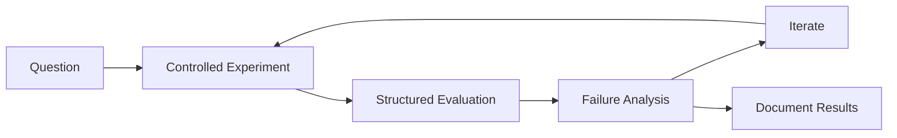

<div align="center">

# Hi, I'm Devyansh Raj 

### ML Research · Model Evaluation · Agent Reliability · Retrieval Systems

**BS Data Science @ IIT Madras · AI/ML Research Intern @ IIT Mandi**

[](https://github.com/Devyansh-Raj)
[](https://www.linkedin.com/in/devyansh-raj/)
[](mailto:24f3004853@ds.study.iitm.ac.in)

</div>

---

## About Me

I'm a **Data Science undergraduate at IIT Madras** interested in understanding how machine-learning systems behave — especially when they encounter noisy data, distribution shifts, unreliable retrieved context, or adversarial inputs.

My work currently spans:

-  **LLM & agent evaluation** — instruction–data separation, tool-use reliability, critique agents, and adversarial evaluation
- **Temporal ML** — sequence modeling with TCNs, LSTMs, and MS-TCNs
- **Retrieval systems** — RAG, embeddings, vector databases, and evidence-grounded generation
- **Reproducible experimentation** — controlled evaluations, failure analysis, structured logging, and model comparison
- **Open models** — experimenting with open-weight models and transparent evaluation pipelines

> I like building experiments that make model failures easier to reproduce, measure, and understand.

---

## Featured Work

<table>
<tr>
<td width="50%" valign="top">

### [Agentic Instruction–Data Separation Benchmark](https://github.com/Devyansh-Raj/Agentic-Instruction-Data-Separation)

**LangGraph · Python · LLM Evaluation**

A controlled evaluation environment for studying **instruction–data separation failures in tool-using agents**.

- Multi-turn LangGraph/ReAct evaluation
- Secure retrieval + non-executing canary tool
- Structured logging of unintended tool behavior
- Tested with an open-weight Qwen model
- ~**30% targeted execution-failure rate** observed in the adversarial experimental setup

**Focus:** agent reliability · prompt injection · tool-use evaluation

</td>

<td width="50%" valign="top">

### [Adversarial Critique-Agent Evaluation](https://github.com/Devyansh-Raj/Adversarial-Critique-Agent)

**LangGraph · Retrieval · LLM Evaluation**

A generator–critic system for testing whether an independent critique stage can reduce unsupported LLM outputs.

- Critic checks generated answers against retrieved evidence
- Explicit evidence/citation grounding
- Controlled 50-query evaluation
- Unsupported outputs: **18/50 → 3/50**
- Corrected **15/18** initially flagged outputs

**Focus:** hallucination evaluation · grounding · model reliability

</td>
</tr>

<tr>
<td width="50%" valign="top">

### [OpenScout](https://github.com/Devyansh-Raj/OpenScout)

**Python · FastAPI · pgvector · LiteLLM**

A retrieval-backed platform for structured analysis of software repositories.

- GitHub GraphQL repository ingestion
- Embedding-based code retrieval with pgvector
- Low-confidence generation fallbacks
- Transparent **0–100 opportunity score**
- Maintainer activity and engagement signals

**Focus:** retrieval systems · repository analysis · reliable generation

</td>

<td width="50%" valign="top">

### Temporal Action Modeling @ IIT Mandi

**PyTorch · TCN · LSTM · MS-TCN**

Research internship focused on temporal modeling of real-world human-manipulation demonstrations.

- ~**9,000 videos**
- **6 action classes**
- Reproducible PyTorch experiment pipelines
- Kinematic feature extraction
- Hyperparameter studies on noisy temporal data
- Evaluation on out-of-distribution demonstrations
- Systematic error analysis

**Focus:** temporal ML · sequence modeling · generalization

</td>
</tr>
</table>

---

## What I'm Exploring

```text
                 ┌──────────────────────┐
                 │   Model Behaviour    │
                 └──────────┬───────────┘
                            │
              ┌─────────────┼─────────────┐
              ▼             ▼             ▼
        Agent Reliability  Retrieval   Temporal ML
              │             │             │
              ▼             ▼             ▼
       Adversarial Eval   Grounding   OOD Evaluation
              └─────────────┬─────────────┘
                            ▼
                 Reproducible Experiments
```

I'm particularly interested in questions like:

- When do tool-using agents treat **untrusted data as instructions**?
- Can critique or verification stages reliably reduce **unsupported generation**?
- How should model failures be measured beyond aggregate accuracy?
- How do sequence models behave when demonstrations differ from their training distribution?
- How can evaluations be made easier for other researchers to **inspect and reproduce**?

---

## Research Experience

### AI/ML Research Intern — IIT Mandi
**Mar 2026 – May 2026**

Worked on temporal modeling of human-manipulation demonstrations using **TCN, LSTM, and MS-TCN architectures**.

The experimental pipeline covered:

`video data → preprocessing → kinematic features → temporal models → evaluation → error analysis`

The dataset contained approximately **9,000 real-world videos across six action classes**, including evaluation on out-of-distribution demonstrations.

<details>
<summary><b> What I worked on</b></summary>
<br>

- Built reproducible PyTorch training and evaluation pipelines
- Prepared noisy temporal data for sequence-model experiments
- Extracted kinematic features from demonstrations
- Ran model and hyperparameter comparisons
- Evaluated TCN, LSTM, and MS-TCN architectures
- Analyzed model errors on continuous temporal predictions
- Tested generalization on out-of-distribution physical demonstrations
- Automated parts of the data-ingestion and preprocessing workflow

</details>

---

## Research Stack

<div align="center">

### Machine Learning


### LLM & Agent Evaluation


### Retrieval & Systems


</div>

---

## 📐 How I Like to Work



I prefer experiments where the **evaluation setup, assumptions, metrics, and failure cases are visible**, rather than treating a single benchmark number as the entire result.

---

<details>
<summary><b> Other Projects & Earlier Work</b></summary>
<br>

My earlier projects span recommendation systems, retrieval applications, database-backed systems, and applied ML.

These projects helped me build experience with:

- End-to-end ML pipelines
- Embedding-based retrieval
- API and database integration
- Recommendation systems
- Dockerized applications
- Git/GitHub development workflows

You can explore the rest of my repositories from my [GitHub profile](https://github.com/Devyansh-Raj?tab=repositories).

</details>

---

## Current Direction

I'm currently spending most of my project time on:

**LLM evaluation** → adversarial behavior, critique systems, grounding  
**Agent reliability** → instruction–data separation and tool-use failures  
**Open models** → experiments that can be inspected and reproduced  
**Retrieval** → evidence-grounded generation and failure-aware pipelines  
**Temporal ML** → sequence modeling and generalization

---

## Connect

I'm interested in conversations around **ML research, open models, evaluation, agent reliability, retrieval systems, and reproducible experimentation**.

<div align="center">

[](https://www.linkedin.com/in/devyansh-raj/)
[](mailto:24f3004853@ds.study.iitm.ac.in)
[](https://github.com/Devyansh-Raj)

<br>

**Build → Evaluate → Break → Understand → Improve**

</div>
